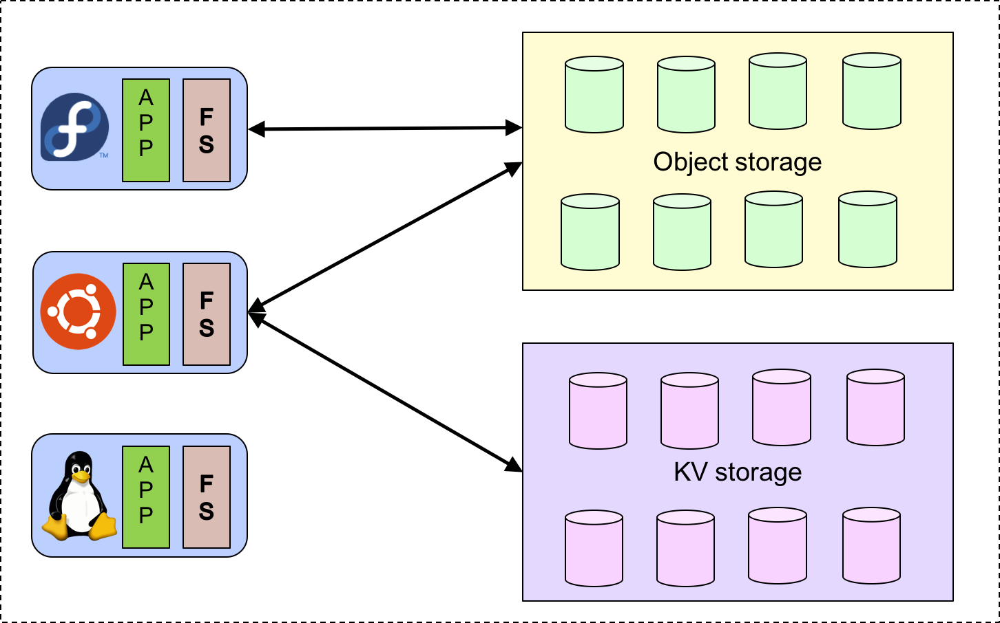
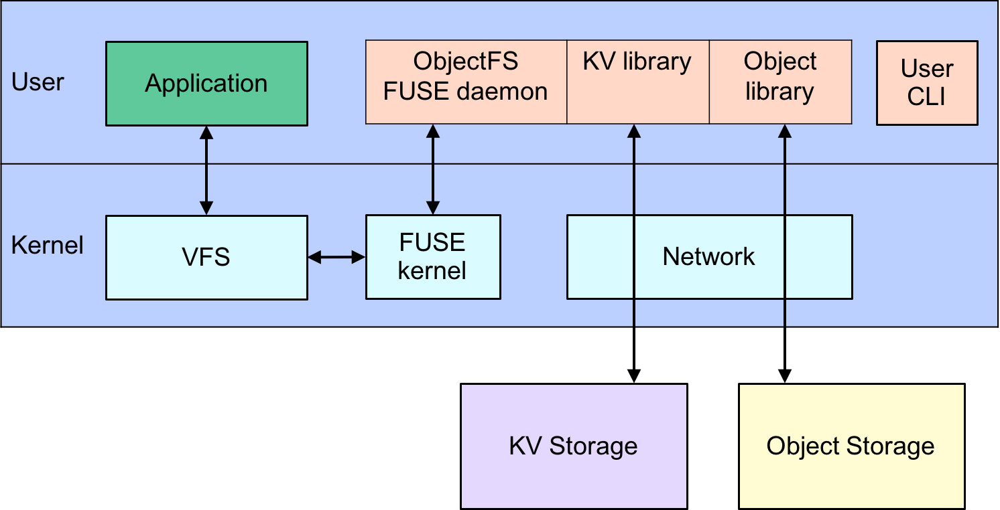
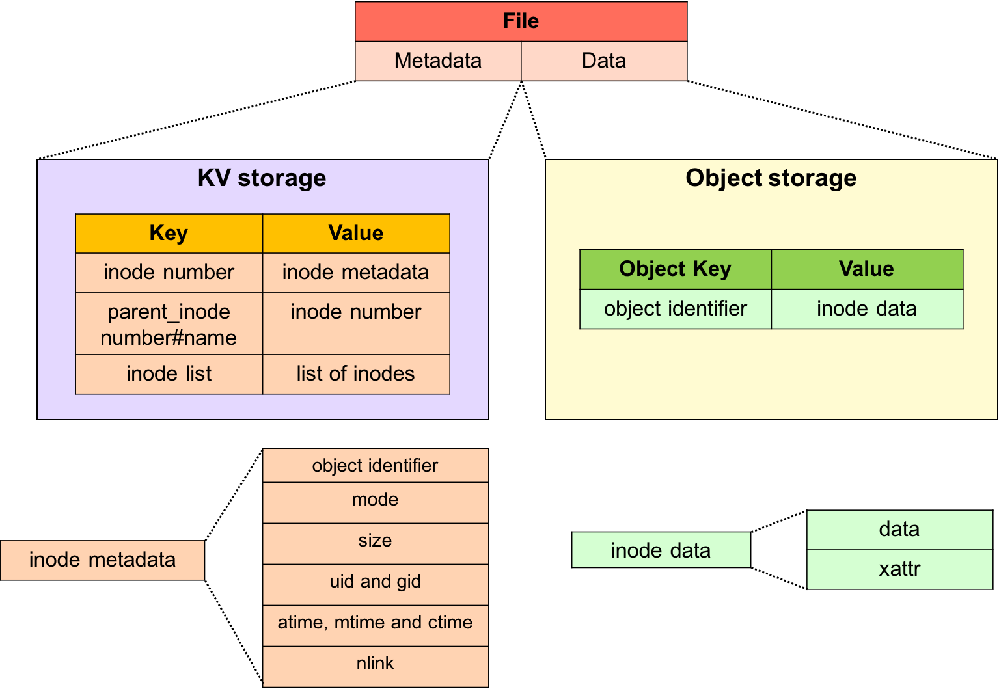

# ObjectFS

A file system with the power of an object store.

## Usage
* Make file-system
```console
./objectfs_cli make <filesystem-name>
```

* Mount file-system
```console
./objectfs_cli mount <filesystem-name> <mount-point>
```

* List all file-systems
```console
./objectfs_cli list
```

* Delete file-system
```console
./objectfs_cli delete <filesystem-name>
```

## Architecture
ObjectFS is a file system which uses object storage as a backend. It's goal is to provide:

* Access data via both file system **and** object interfaces
* Support multiple object stores
* Portable across multiple operating systems

The high-level architecture of ObjectFS:


A stack overview of ObjectFS:


A file in ObjectFS:

